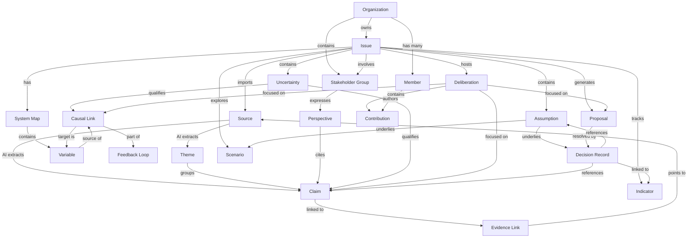
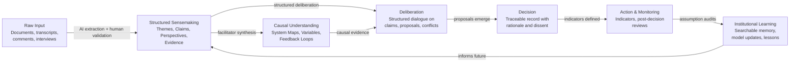

# Domain Map
## Collective Sensemaking Platform

This document describes the conceptual domain model: how the core objects relate to each other, what owns what, and how information flows through the system.

---

## 1. Conceptual Hierarchy

The platform organizes around a single central object: the **Issue**. Everything else either feeds the Issue (inputs), lives inside it (structure), or emerges from it (outputs).

```
Organization
  └─ Issue (the central unit)
        ├─ INPUTS: Sources → Themes → Claims → Evidence
        ├─ CONTEXT: Stakeholder Groups → Perspectives
        ├─ STRUCTURE: Assumptions, Uncertainties
        ├─ MODELS: System Maps → Variables → Causal Links → Feedback Loops
        ├─ PROCESS: Deliberations → Contributions
        ├─ RESOLUTION: Proposals → Decision Records
        ├─ FUTURES: Scenarios
        └─ MONITORING: Indicators
```

---

## 2. Full Domain Map



---

## 3. Layer-by-Layer Breakdown

### Layer 1: Organization & Membership
The outermost container. An Organization owns everything. Members belong to an organization and have roles.

```
Organization
  ├─ has many Members (with roles)
  └─ owns many Issues
```

**Key rule:** Permissions are scoped at the Organization level. All Issues, Sources, and Decision Records belong to one Organization and are not visible across organizations by default.

---

### Layer 2: Issue (The Hub)
The Issue is the atomic unit of collective sensemaking. Every other object is anchored to an Issue.

An Issue is not a task or a ticket. It is a complex problem space that the community is trying to understand together. It has a lifecycle:

```
Draft → Active → Deliberating → Decided → Monitoring → Closed
```

---

### Layer 3: Source Material (Inputs)
Raw knowledge enters the system through Sources. Sources are processed into structured objects by AI (with human validation).

```
Source (PDF, transcript, survey, etc.)
  └─ AI extraction →
        ├─ Themes (content clusters)
        └─ Claims (typed assertions)
              └─ Evidence Links (claim → source passage)
```

**Key rule:** Nothing in the platform is treated as true by virtue of being AI-generated. AI extraction produces *candidates*. Humans accept, edit, or reject them.

---

### Layer 4: Stakeholder & Perspective
Who is involved and how they see the problem. This layer is separate from the Source layer: a perspective is not just what someone said — it is a structured summary of their interests, concerns, and epistemic stance.

```
Stakeholder Group
  └─ Perspective (per issue)
        └─ cites Claims
```

**Key rule:** Perspectives are not averaged. Multiple contradictory perspectives on the same issue are all preserved and visible.

---

### Layer 5: Epistemic Objects
Assumptions and Uncertainties are first-class objects. They qualify other objects rather than owning them.

```
Assumption ──→ underlies Scenario, Decision
Uncertainty ──→ qualifies Claim, Causal Link
```

**Key rule:** Uncertainty is explicit. A Claim or Causal Link that is uncertain is not suppressed — it is annotated and surfaced.

---

### Layer 6: Systems Map *(Phase 3)*
The causal layer. System Maps are collaborative models attached to an Issue.

```
System Map
  ├─ contains Variables
  └─ Variables connected by Causal Links
        ├─ polarity (+ / –)
        ├─ strength and delay
        ├─ confidence and contested flag
        └─ evidence links
              └─ Causal Links compose into Feedback Loops (R or B)
```

**Key rule:** Causal Links are contestable. Any participant can flag a link as disputed, which surfaces it as an Uncertainty.

---

### Layer 7: Deliberation
Structured dialogue attached to specific objects (Claims, Proposals, Causal Links, Assumptions).

```
Deliberation (on a specific object)
  └─ contains Contributions
        └─ typed: Support / Oppose / Question / Refine / Add Evidence
              └─ authored by Members
```

**Key rule:** Deliberation is object-scoped, not free-form. There is no global comment thread. Every contribution belongs to a specific open question or contested object.

---

### Layer 8: Proposals & Decisions
The resolution layer. Proposals emerge from deliberation and Issues. Decisions are formal, immutable records.

```
Proposal (candidate intervention)
  └─ resolved by Decision Record
        ├─ records: outcome, rationale, options considered, criteria
        ├─ records: assumptions used, evidence relied on
        ├─ records: dissenting views (required, not optional)
        └─ linked to: Indicators (for outcome monitoring)
```

**Key rule:** Decision Records are immutable once finalized. If circumstances change, a new Decision Record is created — the old one is never overwritten.

---

### Layer 9: Scenarios *(Phase 4)*
Alternative futures explored before a decision.

```
Scenario
  ├─ has Assumptions
  ├─ has equity and distributional implications
  ├─ has early warning indicators
  └─ can be compared against other Scenarios
```

---

### Layer 10: Indicators *(Phase 5)*
The feedback layer. Indicators link outcomes back to decisions and close the learning loop.

```
Indicator
  ├─ defined at decision time
  ├─ updated with new data over time
  ├─ triggers alerts when diverging from expected trajectory
  └─ links back to Decision Record and System Map
```

---

## 4. Information Flow

This diagram shows how knowledge moves through the platform from raw input to institutional learning:



The most important feature of this flow is the **return arc from Institutional Learning back into Structured Sensemaking**. Without it, each issue starts from scratch. With it, the platform becomes a learning system.

---

## 5. What Is NOT in the Domain

By explicit design, the following concepts are absent from the domain model:

| Absent Concept | Why |
|---|---|
| Comment thread / feed | Replaced by typed Contributions attached to specific objects |
| Vote count | Replaced by structured deliberation with typed positions and minority preservation |
| Notification feed / engagement metrics | Structurally incompatible with epistemic goals |
| User-generated tags (folksonomy) | Claims are typed; tags are controlled by facilitators to prevent noise |
| Draft AI decision | AI never makes or records a decision; it only assists human deliberation |
| Anonymous participation (Phase 1) | Attribution to stakeholder group (if not individual) is required for epistemic accountability |

---

## 6. Key Design Tensions

| Tension | Resolution |
|---|---|
| Synthesis vs. plurality | Synthesis is always a derived view; raw perspectives are the primary record |
| Structure vs. expressiveness | Narrative testimony is preserved as Source; structure is layered on top, not substituted |
| AI speed vs. human validation | AI produces candidates; nothing is canonical until a human accepts it |
| Immutability vs. revisability | Decision Records are immutable; Issues and Maps are versioned and revisable |
| Individual voice vs. stakeholder group | Both exist; contributions are authored by individuals, perspectives are summarized at group level |
